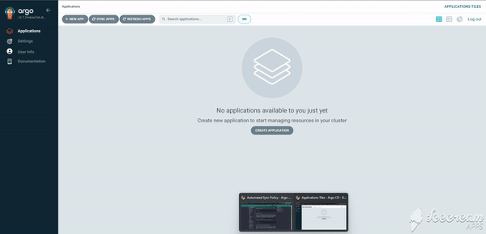
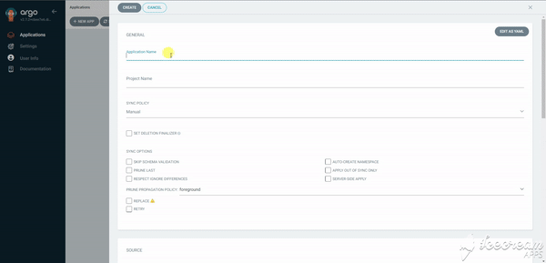
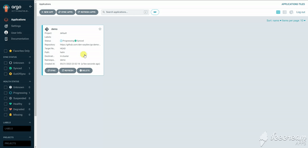

# Creating an Application with ArgoCD

## Login
Login to ArgoCD UI as described in **POC.md**

## Creating an application

After successful login to UI click on the *New App* button in the *Applications* tab.

In the opened window specify the next field:
- General section
 1. *Application name* as chosen by user
 2. *Project name* as "default"
 3. *SYNC POLICY* as "Automatic"
- Source section
 1. *Repository URL* as "https://github.com/den-vasyliev/go-demo-app"
 2. *Path* as "helm"
- Destination section
 1. *Cluster URL* as "https://kubernetes.default.svc"
 2. *Namespace* as chosen by user

 Click *Create* button after that

Notice, that application would start synchronization automatically after creation.

