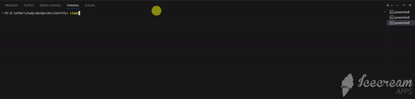
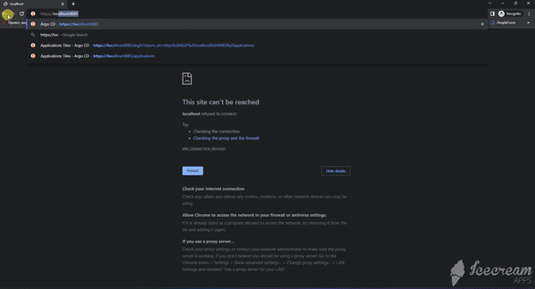
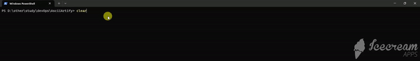

# Getting access to ArgoCD instance

## Requirement
Kubernetes cluster with ArgoCD instance should be deployed and running. User should have access to this cluster with kubectl util.

## Port forwarding
To access to ArgoCD UI you need to port forward from the ArgoCD server to your local machine. To do this, use the following command:

`kubectl port-forward svc/argocd-server -n argocd 8085:443`

After that ArgoCD UI would be forwarder to 8085 port of your local machine. You just need to open the `https:\\localhost:8085` URL in your browser

## Getting username and password

To get username and password to ArgoCD you need to execute the folowing command:

`kubectl -n argocd get secret argocd-initial-admin-secret -o jsonpath="{.data.password}"`

You will get password encoded as base64. Decode the password to plain text and use it with `admin` username.